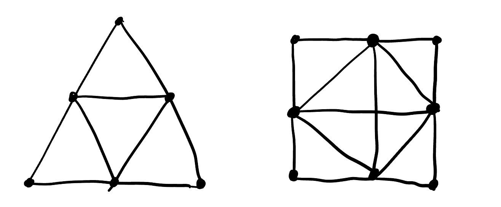

### 2025春季ZXP离散数学(2)期末

***回忆版, 仅供参考***

1. 网络流: 一个四层的网络流, 和作业里的相似但简化了很多.

2. 证明: 最大割集矩阵的 $n-1$ 阶行列式不为 $0$ 的充要条件为这些边对应一棵树.

3. 求下面两个图的色数多项式.

4. 证明: 设图 $G$ 有树 $T$, 对偶图 $G^*$. 记 $T^* = \{e^* \in E(G^*) | e \notin E(T)\}$. 证明: $T^*$ 为 $G^*$ 的树.

5. 定义图的重心为到其余各点的最短距离之和最小的点.

    5.1 证明树至多存在两个重心;

    5.2 设树 $G$ 的一个重心为 $v$. 证明: $G - \{v\}$ 的连通分支的节点数不超过 $\dfrac{n}{2}$.

6. 设 $(X,Y,E)$ 为二分图, $|X| = |Y| = n$. 若图中每个节点的度数都大于 $\dfrac{n}{2}$, 证明这个图存在完美匹配.

7. 对于图 $G$, 若存在两个不相邻的顶点的度数之和大于 $n$, 则将它们连起来, 直到无法再进行下去, 得到的图 $G^*$ 为 $G$ 的闭合图.

    7.1 证明闭合图唯一;
    
    7.2 将有 $v$ 的顶点的图 $G$ 中所有点的度数由大到小排列起来 $(d_1, d_2, \cdots, d_v)$. 满足若 $d_m \leq m$, 则 $d_{v-m} \geq v-m$. 证明 $G$ 中存在 $H$ 回路.

8. 设 $p^km$ 阶群满足 $p$ 为素数, $m$ 和 $p$ 互素, 则(*令人困惑的逻辑连接词*)存在 $p^k$ 阶子群. 证明群中有 $p$ 阶元素.

9. 设 $A$ 上的置换群 $G$. 定义 $G^x = \{g \in G | g(x) = x\}$. $G^x$ 是否为 $G$ 的正规子群? 请证明或举出反例.

10. 设群 $G$, $H$ 是 $G$ 的子群, $K$ 是 $G$ 的正规子群. 证明 $f: hK \to h(H \cap K)$ 是 $HK/K$ 到 $HK/(H\cap K)$ 的同构.

**评议:**

1. 今年计算题明显变少, 证明题变多, 但从 "感觉" 上和去年还是比较接近的.

2. 似乎每年考的重心不一样, 今年树考得特别多, 而去年平面图考得特别多, 至于明年如何, 只有听天由命了.

3. 教材还是很重要, 2 5 7都和教材紧密联系.