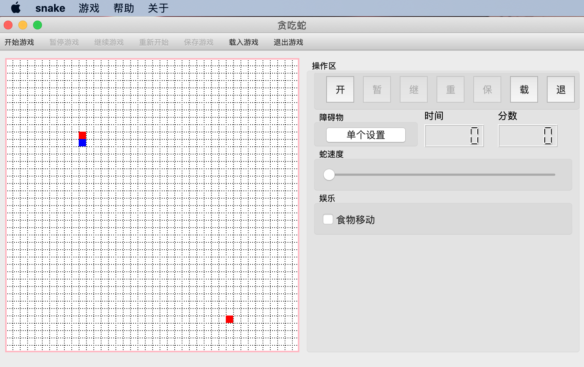
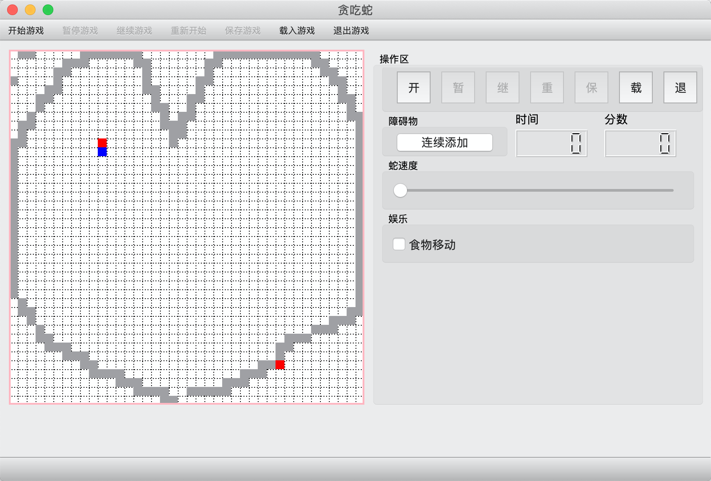
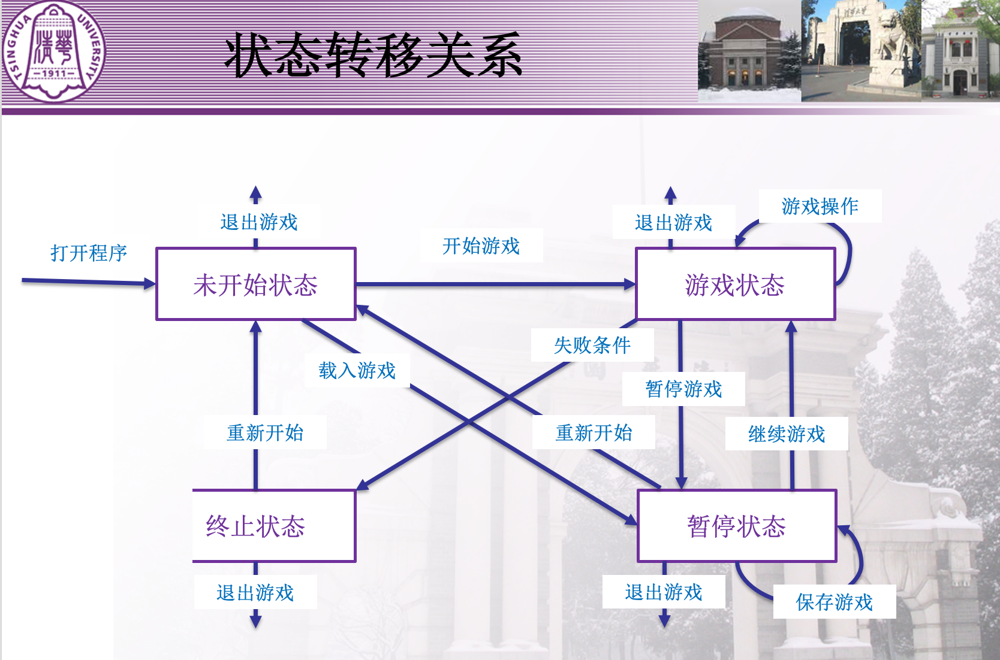
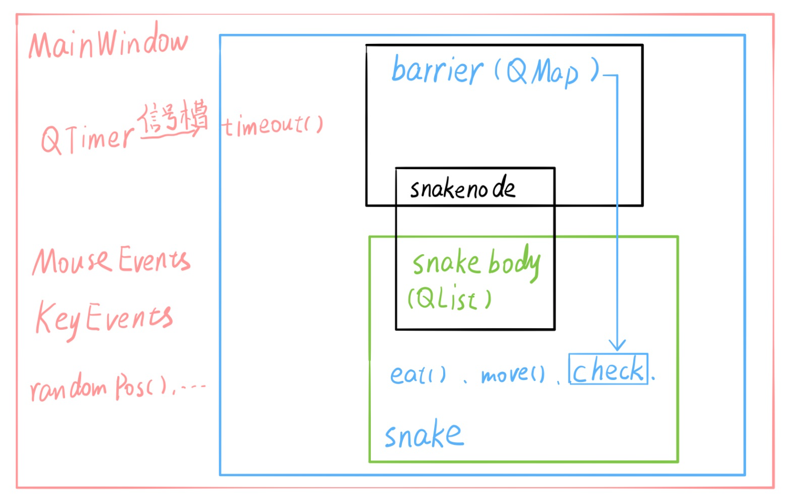

## 第1周大作业：贪吃蛇

> papersnake

一、版本

- Qt: 5.15.0
- Qt Creator: 4.12.3
- Kit: Qt 5.15.0 x86-darwin-generic-mach_o-64bit
- 系统: MacOS 10.15.6

二、实现功能

1. 完成PPT所要求的全部界面，贪吃蛇的游戏界面为40\*40的网格，游戏界面上包括菜单栏、工具栏和按钮，三者均实现开始游戏、暂停游戏、继续游戏、重新开始、退出游戏、保存游戏、载入游戏的功能。
   

2. 完成PPT要求的全部控制逻辑，未开始状态、游戏状态、暂停状态、终止状态的某些按钮处于不可用状态，玩家只有在未开始状态才能载入游戏，游戏状态才能操控蛇，暂停状态才能保存状态，终止状态才能重新开始。

3. 完成PPT要求的蛇的移动逻辑，蛇头和食物为红色，蛇的身体部分为蓝色，每个时间间隔蛇移动一格，同时使用方向键进行转向，同时碰到边界/身体/障碍物判定死亡。

4. 完成PPT要求的障碍物放置设计，在按钮上设计了单个设置/连续放置/连续删除三种模式，实现障碍物的快速放置。
   

5. 完成PPT要求的时间和分数设计，在载入时自动加载，在重新开始时自动清除。

6. 完成PPT要求的保存和载入功能，使用JSON格式实现存储，四位整数存储坐标，实现完美的状态保存和恢复。

   ```yml
   # 保存文件示例
   {
       "barrier": [
           622,
           722,
           723,
           2112,
           2118,
           2119,
           4110,
           4601,
           4701,
           4801,
           4901,
           5000,
           5001,
           5100,
           5200
       ],
       "dir": 2,
       "food": 2520,
       "foodmove": false,
       "isChangable": false,
       "mousePress": 1,
       "ms": 90,
       "predir": 2,
       "score": 6,
       "snakebody": [
           1814,
           1813,
           1812,
           1811,
           1810,
           1809,
           2003,
           2103,
           2203,
           2303,
           2403,
           2503,
           2503
       ],
       "time": 174
   }
   
   ```

7. 附加功能：**实现蛇的移动速度的调整和可选的食物移动功能，来增加难度；利用Github Actions来进行自动化的跨平台编译和发布。**

二、代码架构

核心代码和功能如下：

首先实现蛇的身体块。

```c++
class SnakeNode:public QWidget
{
    Q_OBJECT
public:
    SnakeNode(QWidget *parent = 0);
    SnakeNode(QWidget *parent,int pos);
    SnakeNode(QWidget *parent,int x,int y);
    SnakeNode(QWidget *parent,QPoint pos);
    ~SnakeNode();
    
    void setPos(int x,int y);
    void setPos(int pos);
    void setPos(QPoint pos);
    void setColor(QColor color);
    int intPos();
    QPoint getPos();
    SnakeNode *next;

private:
    void SnakeNode_Init(QWidget *parent);
    QPoint pos;
    QFrame* item;
};
```

每个身体块带有一个单位大小的正方形QFrame，同时重载构造函数和赋值函数实现更直观的函数调用。

```c++
void SnakeNode::SnakeNode_Init(QWidget *parent){
    item = new QFrame(parent);
    item->setAutoFillBackground(true);
    QPalette pa=item->palette();
    QColor red(Qt::red);
    pa.setColor(QPalette::Background,red);
    item->setPalette(pa);
    item->resize(10,10);
    item->show();
    next=NULL;
}
```

然后实现蛇体的对象。

```c++
class SnakeList: public QWidget
{
    Q_OBJECT
public:
    SnakeList(QWidget *parent = 0);
    ~SnakeList();

    void AddHead(QWidget *parent);
    void AddTail(QWidget *parent);
    void DelTail();

    void eat(int dir,QWidget *parent);
    void move(int dir,QWidget *parent);
    int Check(QMap<int,SnakeNode*>& barrier);
    int Check(QMap<int,SnakeNode*>& barrier,QPoint p);

    QList<SnakeNode*> body;
};

#endif // SNAKELIST_H
```

用QList的结构保存蛇的身体块，每次操作只创建头或者删除尾，简洁实现需求。

```c++
void SnakeList::AddHead(QWidget *parent){
    body.push_front( new SnakeNode(parent,body.first()->getPos()));
}
void SnakeList::AddTail(QWidget *parent){
    body.push_back(new SnakeNode(parent,body.back()->getPos()));
    body.back()->setColor(Qt::blue);
}
void SnakeList::DelTail(){
    delete body.takeLast();
}
```

同时使用Check函数判断单位放置的合法性。

```c++
int SnakeList::Check(QMap<int,SnakeNode*>& barrier){
    SnakeNode* head = body.first();
    for(auto node:body){
        if(node!=head&&node->getPos()==head->getPos())
            return 1;
    }
    int b = head->getPos().x()*10 + head->getPos().y()/10;
    if(barrier.find(b)!=barrier.end())
        return 2;
    return 0;
}
```

最后，最外侧的MainWindow实现屏幕事件的处理、游戏进程的调用和游戏状态的储存。

三、设计思路

状态转移关系完全按照PPT设计：



贪吃蛇逻辑自行设计：

四、游戏难点解决

1. 游戏Bug
   修改代码过程中产生一堆Bug，解决方法是不断测试、不断修改并反复思考游戏逻辑。
   同时使用直观的Has-A逻辑，降低代码复杂度、增加代码可读性。

2. 跨平台相对坐标发生变化

   **原来**：使用手动测定的变化量

   ```c++
   QPoint pos = ui->label->pos();
   int x=pos.x()-30,y=pos.y()-20;
   x = x/10*10;
   y = y/10*10；
   ```

   Mac上测试正常，Windows上由于菜单栏位置变化导致对应错误。

   **现在**：使用Qt响应类提供的mapFromGlobal/mapToGlobal方法

   ```c++
   QPoint pos = ui->label->mapFromGlobal(event->globalPos());
   int x=pos.x(),y=pos.y();
   x = x/10*10;
   y = y/10*10;
   ```

   获取到的坐标由系统决定，测试正常。

3. 对游戏状态的把握
   通过一个QTimer组件和几个布尔参数解决。

4. 缺少安装了 Qt 的 Windows 电脑

尝试使用Docker，发现太过复杂；之后转向Github Actions，参考[HelloActions-Qt](https://github.com/jaredtao/HelloActions-Qt)实现Mac/Windows10双平台的自动化编译与发布，同时编译Andriod\IOS\Linux版本。

```yml
name: Build Release
on: 
  push:
    tags:
      - v*
env:
  targetName: snake
jobs:
  publish:
    name: Upload Release Asset
    runs-on: ubuntu-latest
    outputs:
      upload_Url: ${{ steps.create_release.outputs.upload_url }}
    steps:
      - name: Checkout code
        uses: actions/checkout@v2
      - name: Create Release
        id: create_release
        uses: actions/create-release@v1
        env:
          GITHUB_TOKEN: ${{ secrets.GITHUB_TOKEN }}
        with:
          tag_name: ${{ github.ref }}
          release_name: Release ${{ github.ref }}
          draft: false
          prerelease: false
  buildMac:
    name: Build MacOS
    runs-on: ${{ matrix.os }}
    needs: publish
    strategy:
      matrix:
        os: [macos-latest]
        qt_ver: [5.15.0]
        qt_arch: [clang_64]
    steps:
      - name: cacheQt
        id: MacosCacheQt
        uses: actions/cache@v1
        with:
          path: ../Qt/${{matrix.qt_ver}}/${{matrix.qt_arch}}
          key: ${{ runner.os }}-Qt/${{matrix.qt_ver}}/${{matrix.qt_arch}}
      - name: Install Qt
        # if: steps.MacosCacheQt.outputs.cache-hit != 'true'
        uses: jurplel/install-qt-action@v2
        with:
          version: ${{ matrix.qt_ver }}
          cached: ${{ steps.MacosCacheQt.outputs.cache-hit }}
      - uses: actions/checkout@v1
        with:
          fetch-depth: 1
      - name: build macos
        run: |
          qmake
          make
      # tag 打包
      - name: package
        if: startsWith(github.event.ref, 'refs/tags/')
        run: |
          # 拷贝依赖
          macdeployqt bin/${targetName}.app -qmldir=. -verbose=1 -dmg
      # tag 上传Release
      - name: uploadRelease
        id: uploadRelease
        if: startsWith(github.event.ref, 'refs/tags/')
        env:
          GITHUB_TOKEN: ${{ secrets.GITHUB_TOKEN }}
        uses: actions/upload-release-asset@v1
        with:
          upload_url: ${{ needs.publish.outputs.upload_Url }}
          asset_path: ./bin/${{ env.targetName }}.dmg
          asset_name: ${{ env.targetName }}.dmg
          asset_content_type: application/applefile
      - name: uploadArtifact
        uses: actions/upload-artifact@v2
        with:
          name: MacOS
          path: bin
  buildWin:
    name: Build Windows
    # 运行平台， windows-latest目前是windows server 2019
    runs-on: windows-latest
    needs: publish
    strategy:
      # 矩阵配置
      matrix:
        qt_ver: [5.13.0]
        qt_target: [desktop]
        # mingw用不了
        # qt_arch: [win64_msvc2017_64, win32_msvc2017, win32_mingw53,win32_mingw73]
        qt_arch: [win64_msvc2017_64, win32_msvc2017]
        # 额外设置msvc_arch
        include:
          - qt_arch: win64_msvc2017_64
            msvc_arch: x64
            qt_arch_install: msvc2017_64
          - qt_arch: win32_msvc2017
            msvc_arch: x86
            qt_arch_install: msvc2017
    # 步骤
    steps:
      - name: cacheQt
        id: WindowsCacheQt
        uses: actions/cache@v1
        with:
          path: ../Qt/${{matrix.qt_ver}}/${{matrix.qt_arch_install}}
          key: ${{ runner.os }}-Qt/${{matrix.qt_ver}}/${{matrix.qt_arch}}
      - name: Install Qt
        # if: steps.WindowsCacheQt.outputs.cache-hit != 'true'
        # 使用外部action。这个action专门用来安装Qt
        uses: jurplel/install-qt-action@v2
        with:
          # Version of Qt to install
          version: ${{ matrix.qt_ver }}
          # Target platform for build
          target: ${{ matrix.qt_target }}
          # Architecture for Windows/Android
          arch: ${{ matrix.qt_arch }}
          cached: ${{steps.WindowsCacheQt.outputs.cache-hit }}
      # 拉取代码
      - uses: actions/checkout@v1
        with:
          fetch-depth: 1
      # 编译msvc
      - name: build-msvc
        shell: cmd
        env:
          vc_arch: ${{ matrix.msvc_arch }}
        run: |
          call "C:\Program Files (x86)\Microsoft Visual Studio\2019\Enterprise\VC\Auxiliary\Build\vcvarsall.bat" %vc_arch%
          qmake
          nmake
      # tag 打包
      - name: package
        if: startsWith(github.event.ref, 'refs/tags/')
        env:
          VCINSTALLDIR: 'C:\Program Files (x86)\Microsoft Visual Studio\2019\Enterprise\VC'
          archiveName: ${{ env.targetName }}-${{ matrix.qt_arch }}
        shell: pwsh
        run: |
          # 创建文件夹
          New-Item -ItemType Directory ${env:archiveName}
          # 拷贝exe
          Copy-Item bin\${env:targetName}.exe ${env:archiveName}\
          # 拷贝依赖
          windeployqt --qmldir . ${env:archiveName}\${env:targetName}.exe
          # 打包zip
          Compress-Archive -Path ${env:archiveName} ${env:archiveName}'.zip'
          # 记录环境变量packageName给后续step
          $name = ${env:archiveName}
          echo "::set-env name=packageName::$name"
          # 打印环境变量packageName
          Write-Host 'packageName:'${env:packageName}
      # tag 上传Release
      - name: uploadRelease
        id: uploadRelease
        if: startsWith(github.event.ref, 'refs/tags/')
        env:
          GITHUB_TOKEN: ${{ secrets.GITHUB_TOKEN }}
        uses: actions/upload-release-asset@v1
        with:
          upload_url: ${{ needs.publish.outputs.upload_Url }}
          asset_path: ./${{ env.packageName }}.zip
          asset_name: ${{ env.packageName }}.zip
          asset_content_type: application/zip
      - name: uploadArtifact
        uses: actions/upload-artifact@v2
        with:
          name: ${{ matrix.qt_arch }}
          path: bin
  buildAnd:
    name: Build Android
    runs-on: ${{ matrix.os }}
    needs: publish
    strategy:
      matrix:
        os: [ubuntu-latest]
        # 5.9.8 版本低，需要额外设置工具链。这里暂不支持。
        qt_ver: [5.12.6]
        qt_target: [android]
        # android_arm64_v8a 暂时不支持. install-qt-action 依赖的aqtinstall版本为0.5*,需要升级
        # qt_arch: [android_x86,android_armv7,android_arm64_v8a]
        qt_arch: [android_x86,android_armv7]
        # exclude:
        #   - qt_ver: 5.9.8
        #     qt_arch: android_arm64_v8a
    steps:
      - name: Install Qt
        # if: steps.cacheqt.outputs.cache-hit != 'true'
        uses: jurplel/install-qt-action@v2
        with:
          # Version of Qt to install
          version: ${{ matrix.qt_ver }}
          # Target platform for build
          target: ${{ matrix.qt_target }}
          # Architecture for Windows/Android
          arch: ${{ matrix.qt_arch }}
      - uses: actions/checkout@v1
        with:
          fetch-depth: 1
      - name: build android
        run: |
          export ANDROID_SDK_ROOT=$ANDROID_HOME
          export ANDROID_NDK_ROOT=$ANDROID_HOME/ndk-bundle
          qmake
          make
      - name: uploadArtifact
        uses: actions/upload-artifact@v2
        with:
          name: ${{ matrix.qt_arch }}
          path: bin
  buildIos:
    name: Build IOS
    runs-on: ${{ matrix.os }}
    needs: publish
    strategy:
      matrix:
        os: [macos-latest]
        qt_ver: [5.12.6]
        qt_target: [ios]
    steps:
      - name: Install Qt
        # if: steps.cacheqt.outputs.cache-hit != 'true'
        uses: jurplel/install-qt-action@v2
        with:
          # Version of Qt to install
          version: ${{ matrix.qt_ver }}
          # Target platform for build
          target: ${{ matrix.qt_target }}
      - uses: actions/checkout@v1
        with:
          fetch-depth: 1
      - name: build ios
        run: |
          qmake -r -spec macx-ios-clang CONFIG+=release CONFIG+=iphoneos
          make
      - name: uploadArtifact
        uses: actions/upload-artifact@v2
        with:
          name: IOS
          path: bin
  buildLin:
    name: Build Linux
    runs-on: ${{ matrix.os }}
    needs: publish
    strategy:
      matrix:
        os: [ubuntu-18.04]
        qt_arch: [gcc_64]
        qt_ver: [5.15.0]
    steps:
      - name: cacheQt
        id: UbuntuCacheQt
        uses: actions/cache@v1
        with:
          path: ../Qt/${{matrix.qt_ver}}/${{matrix.qt_arch}}
          key: ${{ runner.os }}-Qt/${{matrix.qt_ver}}/${{matrix.qt_arch}}
      - name: Install Qt
        # if: steps.UbuntuCacheQt.outputs.cache-hit != 'true'
        uses: jurplel/install-qt-action@v2
        with:
          version: ${{ matrix.qt_ver }}
          cached: ${{ steps.UbuntuCacheQt.outputs.cache-hit }}
      - name: ubuntu install GL library
        run: sudo apt-get install -y libglew-dev libglfw3-dev
      - uses: actions/checkout@v1
        with:
          fetch-depth: 1
      - name: build ubuntu
        run: |
          qmake
          make
      # tag 上传Release
      - name: uploadRelease
        id: uploadRelease
        if: startsWith(github.event.ref, 'refs/tags/')
        env:
          GITHUB_TOKEN: ${{ secrets.GITHUB_TOKEN }}
        uses: actions/upload-release-asset@v1
        with:
          upload_url: ${{ needs.publish.outputs.upload_Url }}
          asset_path: ./bin/${{ env.targetName }}
          asset_name: ${{ env.targetName }}
          asset_content_type: application/applefile
      - name: uploadArtifact
        uses: actions/upload-artifact@v2
        with:
          name: Linux
          path: bin
```

具体实现可见github项目 [prnake](https://github.com/prnake)/**[snake_qt_demo](https://github.com/prnake/snake_qt_demo)**。

 