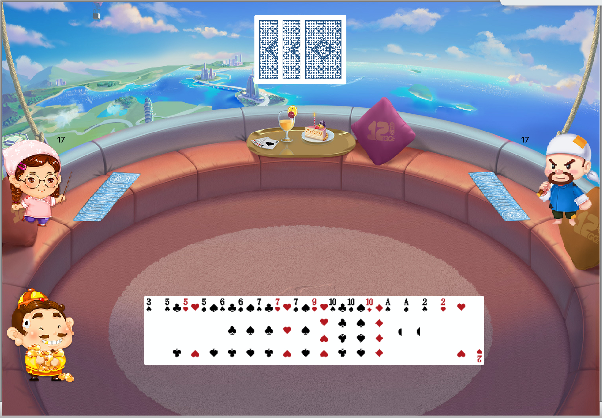

# 第二周 - 斗地主设计文档

> papersnake

## 版本

- Qt: 5.15.0
- Qt Creator: 4.12.3
- Kit: Qt 5.15.0 x86-darwin-generic-mach_o-64bit
- 系统: MacOS 10.15.6

## 实现功能

- 准备界面的开始连接按钮的功能

- 三个节点建立连接，同步数据

- [叫地主/不叫]按钮功能

- 决定地主/农民身份并显示

- 手牌及地主底牌的显示

- 其他玩家的手牌数的显示

- 选中要出的牌的视觉效果

- 判断所出牌是否合法并提示

- 出牌后在所有玩家界面显示

- 不出的功能

- 叫地主及出牌的顺序一致

- 重新开始功能
- 随机背景
- 发牌动画
- 部分语音

## 游戏逻辑

点击开始游戏->建立连接->协商随机数确定顺序->随机发牌和确定底牌->通知顺序1抢地主->顺序1选择->通知顺序2抢地主->顺序2抢地主->顺序2选择->通知顺序3抢地主->顺序3抢地主->顺序3选择->通知选择最后一次叫地主的人当地主->地主开始游戏->地主出牌->合法性检测->广播牌型->显示出牌->下家出牌/要不起->…->上次是自己出牌->选择出牌->…->出的牌为全部的牌->通知胜利–>各客户端判断胜利/失败->点击再玩一次->广播->如果三个人重开->重新开始->随机发牌和确定底牌->...

## 斗地主规则检查及比较器

​        参考[维基百科](https://en.wikipedia.org/wiki/Dou_dizhu)和 python 实现的斗地主规则检查器 [onestraw](https://github.com/onestraw)/**[doudizhu](https://github.com/onestraw/doudizhu)** ，使用c++实现枚举细分牌型，生成与花色无关、顺序无关的字典，达到在O(1)时间内判断出牌是否有效，判断出牌多义性，并在O(1)时间内比较大小的效果。

### 各牌型组合数

以下计算参考[维基百科](https://en.wikipedia.org/wiki/Dou_dizhu)和 [onestraw](https://github.com/onestraw)/**[doudizhu](https://github.com/onestraw/doudizhu)** 

#### 单牌

- 1连
  - C(15,1)=15
- 5连
  - C(8,1)=8
- 6连
  - C(7,1)
- 7连
  - C(6,1)
- 8连
  - C(5,1)
- 9连
  - C(4,1)
- 10连
  - C(3,1)
- 11连
  - C(2,1)
- 12连
  - C(1,1)

#### 对子

- 1连
  - C(13,1) = 13
  - 不考虑王炸
- 3连
  - C(10,1)
- 4连
  - C(9,1)
- 5连
  - C(8,1)
- 6连
  - C(7,1)
- 7连
  - C(6,1)
- 8连
  - C(5,1)
- 9连
  - C(4,1)
- 10连
  - C(3,1)

#### 三张

- 1连
  - C(13,1) = 13
- 2连
  - C(11,1)
  - 不考虑2
- 3连
  - C(10,1)
- 4连
  - C(9,1)
- 5连
  - C(8,1)
- 6连
  - C(7,1)

#### 三带一

基数参考前一节的三张组合数，所带牌型再组合

- 1连
  - C(13,1) x C(14,1) = 182
- 2连
  - C(11,1) x [C(13,2) + 11] = 979
  - 带的两张可以相同，可以是Joker，但不能出现四张相同的
- 3连
  - C(10,1) x [C(12,3) + 10 + 10x11] = 3400
- 4连
  - C(9,1) x [45 + 330 + 495] = 7830
- 5连
  - C(8,1) x [120 + 660 + 784] = 12512

#### 三带二

- 1连
  - C(13,1) x C(12,1) = 156
- 2连
  - C(11,1) x H(11,2) = 726
- 3连
  - C(10,1) x H(10,3) = 2100
- 4连
  - C(9,1) x 414 = 3726

#### 四带二单

- C(13,1) x [H(14,2) - 2] = 1339

#### 四带二对

- C(13,1) x H(12,2) = 1014

#### 炸弹

压制点数比其小的炸弹及非王炸，上面所有牌型

- 13

#### 火箭

压制一切

- 1

### 代码实现

​        实现`spilt, join,make_index,make_count,make_copy,sort`等方法，按照上文规则枚举牌型，并使用`std::unordered_map<std::string,std::vector<std::pair<std::string,int>>> `存储牌型数据。

## 网络逻辑

​        使用QtRO。 QtRO本质上是一个点对点的通信网络，封装了序列化和反序列化过程。用户可以假装有一个对象可供访问，而实际上这个对象存在于另一个进程，甚至另一台计算机中。每个进程通过QRemoteObjectNode接入QtRO网络。功能提供节点需要使用QRemoteObjectHost将一个提供实际功能的QObject派生类注册进QtRO网络中，然后其他使用该功能的程序则通过各自的QRemoteObjectNode连接到该Host上，然后acquire一个该功能对象的Replica。等到该Replica初始化好后，该程序就能够使用Replica中的信号、槽以及属性。

​		游戏中三个客户端各自实例化一个server，一个client，每次通讯同时使用server广播和点对点通知client，进行广播型组网。

