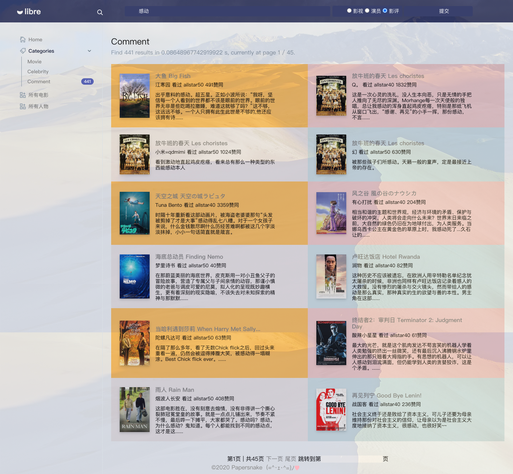
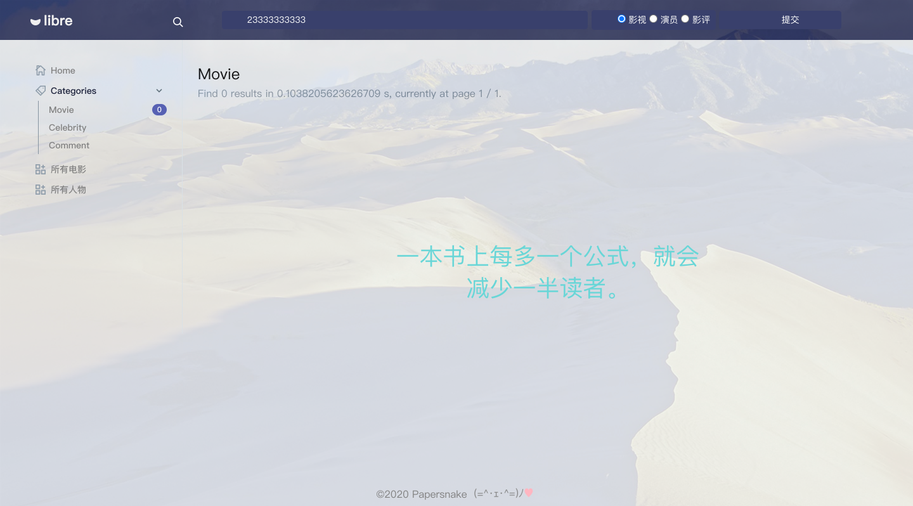
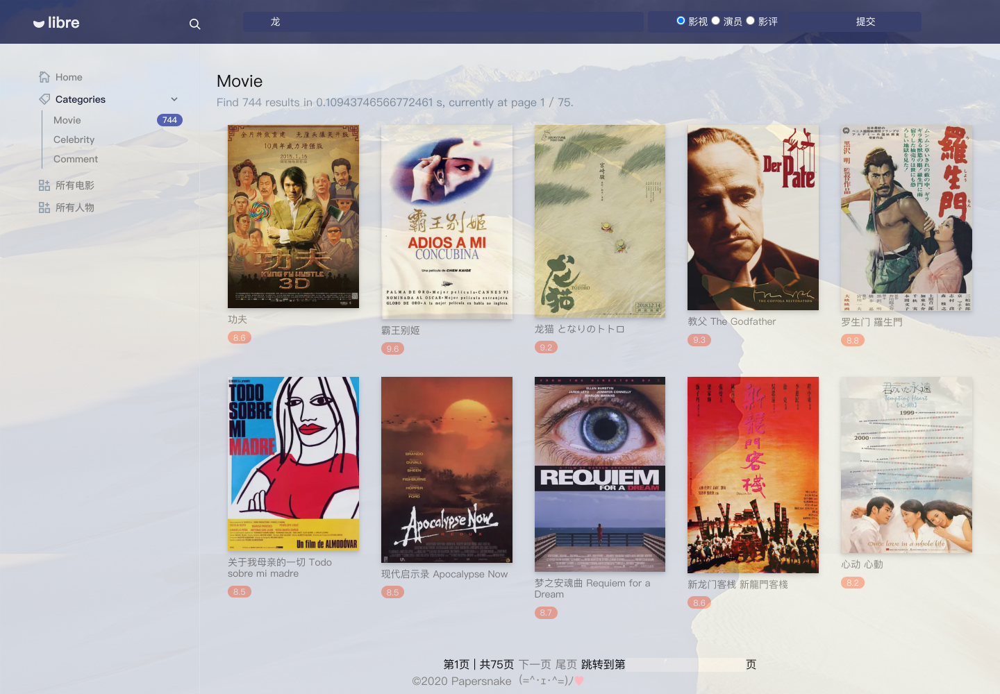

# 影视爬虫与检索系统

> papersnake

## 功能展示

DEMO：https://ipku.club/（暂时可用）

### 主界面


## 影视/演员列表

### 影视列表


### 演员列表


### 影评搜索



### 电影/演员信息界面


### 404界面

随机 [Hitokoto](https://hitokoto.cn/)（一言）



## 数据

### 数据爬取

​		使用python、ip池和MySQL，爬取豆瓣电影6,735条，人物38,000条。由于豆瓣反爬严格，故在多次尝试后选择了带登陆cookie，随机ip的爬取策略，并大量使用```try…get```防止异常导致程序结束，消耗750个ip和一晚上在服务器上爬完（由于使用单线程速度较慢）。数据爬取完成后，根据电影演员列表生成演员的参演电影列表，并为每个演员生成共同参演演员的字典统计次数。

### 数据导入

​		在django中设置好mysql后使用 ```*python manage*.*py inspectdb* > models.py```自动生成```models.py```文件，即可使用爬虫存入数据库的数据（同时数据库中数据还可不依赖django继续更新）。id使用数字存储，List、Dict等数据结构转为str后使用text字段存储，再使用正则表达式或```ast.literal_eval```安全转换回原数据结构。

### 数据检索

​		使用django自带的Q方法和filter进行全文检索，由于数据量不大，普通查询的时间能控制在100ms以内。同时对要求的电影/演员列表，直接使用搜索空格的界面即可，并在搜索空格时返回特殊标题。

### 数据展示

​		使用响应式网站模版魔改成符合大作业要求的django模版，并使用nginx反向代理+ssl证书部署到域名。




