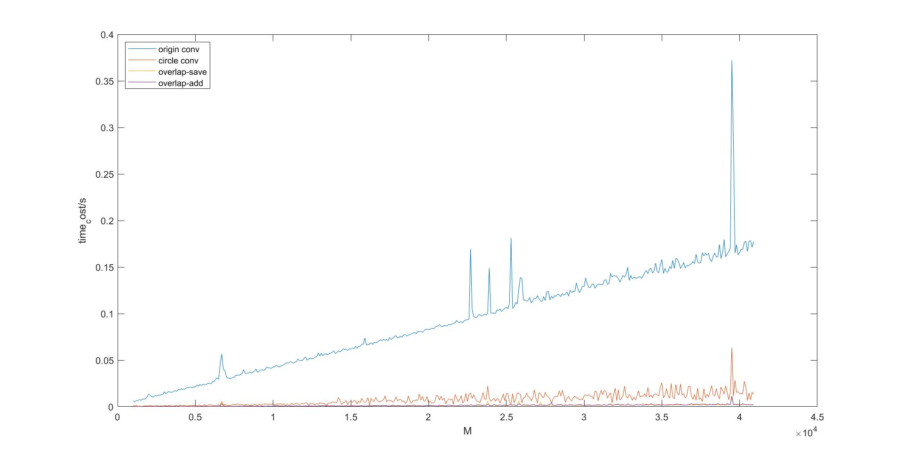

## 信号处理原理实验报告

> 陈海天 计73 2016010106

### Ex1 双音频按键识别

##### 1.1 算法与代码

使用了两种不同的方法来识别按键音：

1. 手动实现goertzel算法，在八个频率中找出最高的两个峰值作为预测结果（按一定条件过滤噪声）
2. 使用matlab内置的fft函数，找出低频高频的两个峰值查表作为预测结果

在main.m中写了两个函数`fft_test` `goertzel`分别实现上面两种方法，运行main.m即可得到结果。

##### 1.2 实验结果

1. 单按键测试

用自己手机录了键盘上的12个按键音，放在data目录下（11--*，12--#），采样频率fs=48000，样本的长度在半秒左右。N取4000的结果如下：（其中time_ratio为fft_time/grt_time）

|length |fft-result |fft-time |grt-result |grt-time |time ratio |
| ----  |   ----    |   ----  |   ----    |   ----  |    ----   |
| 4000  |     0     |0.000207 |     0     |0.000319 | 0.649937  |
| 4000  |     1     |0.000170 |     1     |0.000238 | 0.717172  |
| 4000  |     2     |0.000146 |     2     |0.000237 | 0.617138  |
| 4000  |     3     |0.000149 |     3     |0.000234 | 0.633532  |
| 4000  |     4     |0.000151 |     4     |0.000237 | 0.640592  |
| 4000  |     5     |0.000151 |     5     |0.000237 | 0.637785  |
| 4000  |     6     |0.000146 |     6     |0.000293 | 0.498120  |
| 4000  |     7     |0.000150 |     7     |0.000305 | 0.491148  |
| 4000  |     8     |0.000148 |     8     |0.000236 | 0.628450  |
| 4000  |     9     |0.000157 |     9     |0.000235 | 0.669365  |
| 4000  |     *     |0.000147 |     *     |0.000236 | 0.620237  |
| 4000  |     #     |0.000152 |     #     |0.000236 | 0.644161  |

N取样本长度时的结果如下：
|length |fft-result |fft-time |grt-result |grt-time |time ratio |
| ----  |   ----    |   ----  |   ----    |   ----  |    ----   |
|25695  |     0     |0.002802 |     0     |0.001537 | 1.823246  |
|14988  |     1     |0.000697 |     1     |0.000871 | 0.799656  |
|19985  |     2     |0.001747 |     2     |0.001007 | 1.735525  |
|19271  |     3     |0.001737 |     3     |0.001216 | 1.429006  |
|19985  |     4     |0.001487 |     4     |0.000947 | 1.570976  |
|23018  |     5     |0.001132 |     5     |0.001186 | 0.955048  |
|19271  |     6     |0.001650 |     6     |0.000914 | 1.803937  |
|23018  |     7     |0.001307 |     7     |0.001161 | 1.125560  |
|18736  |     8     |0.000736 |     8     |0.000890 | 0.826947  |
|22483  |     9     |0.002732 |     9     |0.001115 | 2.449646  |
|23019  |     *     |0.002042 |     *     |0.001083 | 1.885400  |
|24625  |     #     |0.001880 |     #     |0.001597 | 1.177458  |

可见goertzel的准确性是没问题的。从性能上来说，当N大时，goertzel算法速度更快。这与理论结果相符，goertzel算法计算K个点的时间复杂度为O(KN)，而fft的时间复杂度为O(NlogN)，所以N越大，goertzel更有优势。

2. 长音频测试

录了一段连续的长音频（电话号码），N分别取fs=48000, fs/3=16000, fs/6=8000，可得到结果如下：

```
'-'表示噪声，噪声筛除方式：
goertzel: 如果大于[0.3*最大能量]的点超过两个，则认为是噪声
fft: 如果能量小于一定阈值，则认为是噪声

N = 48000
FFT time_cost: 0.044336 s
ans: -82756#99
Goertzel time_cost: 0.022292 s
ans: 18--56-99

N = 16000
FFT time_cost: 0.034408 s
ans: ---8-22-1177-5-6699-0-99-99
Goertzel time_cost: 0.022509 s
ans: 1--8-22-1177-5-6699-0099-99

N = 8000
FFT time_cost: 0.035877 s
ans: ------88---22----11--777--55---66--999---0---99---999-
Goertzel time_cost: 0.023650 s
ans: 11----88---22----11--777--55---66#-999--000--99---999#
```

可见goertzel的准确性非常好，和fft不相上下，而且所用时间基本不变，因为它是线性关系。而fft的时间随batch_size的减小而减小。


### Ex2 卷积计算方法的性能比较

按照要求用以下四种方式计算卷积：`公式法` `圆卷积` `overlap-add` `overlap-save` 

所得的实验结果如下图所示（取了400个点，步长100，h的长度M=1000）：



可见手搓的公式法求解速度最慢（其实内置函数的公式法是最快的，但是这应该是matlab在底层做了优化）；其次是圆卷积fft；两个overlap方法计算都很快，这是因为它们比较适合这种长短差异较大的序列的卷积求解。

### Ex3 语音信号的频分复用

本题有多种理解方式（感觉题目要求没太说清楚），我的理解方式是用同样长度的序列编码三条语音，并且恢复以后尽可能不失真。在这种理解方式下，有两种做法：

1. 因为我们手机录的素材采样频率基本都在48k左右，而语音的带限是3.4k，所以可以直接在频域上截断三个信号然后拼起来。但是这种方式是有限制的，当采样频率小的时候就会严重失真。
2. 第二种方式就是现在时域上进行1/3抽取，然后在按照ppt上的上采样--滤波--累加的方式。这样相当于在损失了一些音质，但是适用范围更广。

两种方式都会损失信息，因为想要用一条语音的数据量存下三条语言，肯定是要损失一些东西的。我最后采用的方式是第二种（因为这样也可以按照ppt上介绍的流程来）。

算法流程在代码注释中写的很详细了，大致为：

1. 先将三条语音裁成同样长度，并进行1/3抽取
2. 进行上采样，并fft得到上采样后的频域信号
3. 在频域上编码
4. 转换回时域

解码过程就是上述的逆过程。

#### 实验结果如下所示：


上图为三条原始音频信号。


上图为三条原始音频的频谱。


上图为上采样之后三条音频的频谱，可见在一个fs内出现了三个周期。


上图为编码之后的频谱与音频信号。可见频谱上的确是三条信号分开了。


上图为解码之后恢复的音频信号。可见和原来的音频信号完全一致，试听效果也很好。
