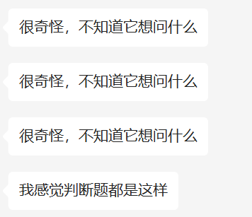

所有考卷在 http://os.cs.tsinghua.edu.cn/oscourse/ 上都能找到

## 2023 Spring

判断题

大题

- RTOS：①解释优先级继承；②解释优先级天花板协议；③把实验操作系统改成 RTOS 需要做什么修改
- process, thread and coroutine：①对比三者的不通点；②给定 3 种实际应用场景，分别该使用什么
- deadlock: ①简述死锁产生的必要条件 ②简述 banker's algorithm 并在给定的例子上执行
- fs：文件系统有关的概念和计算题
- fork：运行一段带有 fork 的程序，① 程序 fork 了多少次 ②画出进程树 ③ 各进程退出时，某个变量的值分别为多少
- sync mutex: ① Peterson算法改错 ② 用信号量完成生产者 - 消费者问题。要求一个消费者连续取用 5 次后，其余消费者才可以取用
- fs journaling: 与 2021 春 19 题几乎完全一样
