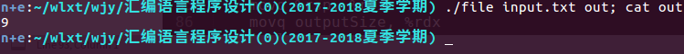
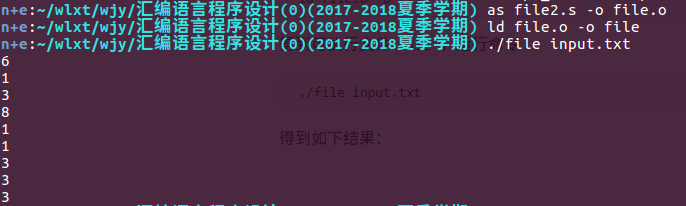

# HW2

>计64 翁家翌 2016011446

[TOC]

## 1：C函数返回struct类型是如何实现的

首先在caller中开辟栈空间：`subq $32, %rsp`

其次将当前栈指针当做参数传入callee中：`movq %rsp, %rdi`

在函数调用完成之后，堆栈如下：

```text
| %rsp+24 | /  |
| %rsp+20 | /  |
| %rsp+16 | n  |
| %rsp+12 | n  |
| %rsp+8  | 2n |
| %rsp+4  | n  |
| %rsp    | n  |  <- TEST_Struct
```

也就是struct类型依靠指针返回，先把数据写到某个地方，返回这个地方的索引。

## 2：C函数是如何传入struct类型参数的

在 `call input_struct` 之前，程序栈如下：

```text
| %rsp+48 | /  |
| %rsp+44 | /  |
| %rsp+40 | /  |
| %rsp+36 | i  |
| %rsp+32 | 2i |
| %rsp+28 | i  |
| %rsp+24 | i  | <- main_struct
| %rsp+20 | /  |
| %rsp+16 | i  |
| %rsp+12 | i  |
| %rsp+8  | 2i |
| %rsp+4  | i  |
| %rsp    | i  | <- copied main_struct
```

可见C在传入struct时，借助栈在caller栈中生成了一个临时变量struct，将其首地址传给callee进行操作。

我觉得栈中的变量不全（`%rsp+40`没东西 ）、input_struct调用的是 `24(%rsp)` 而不是 `%rsp`，是由于编译器优化而导致的。

## 3

### 3.1

代码位于 `file.s `中

输入文件 `input.txt` 如下：

```
edqew4
q
qew
r32r\n\0
1
3
123
213
dsa
```

使用命令

```bash
as file.s -o file.o
ld file.o -o file
```

得到可执行文件 `file` ，运行命令

```bash
./file input.txt out; cat out
```

得到如下结果：



-----

设计说明：

首先开辟一个buffer，长度为100000，假设文件大小不会超过这个数字

使用sysread把文件读进来到buffer里面

循环判断字符是否为`\n`，如果是的话计数器lineCount加一

将计数器数字转换为字符串，压入栈中，传给syswrite输出

### 3.2

代码位于 `file2.s` 中，输入文件同上

使用命令

```bash
as file2.s -o file.o
ld file.o -o file
```

得到可执行文件 `file` ，运行命令

```bash
./file input.txt
```

得到如下结果：



每次从文件中读入一行并输出字符串长度到stdout

---

设计说明：

getline函数：假设每行最长长度不超过 `%rdx`。每次调用getline时候，读入到buffer中。从buffer中获取第一个 `\n` 出现的位置（存为`%rax`）和有效读取字符数目（存为`%rcx`），计算偏移量之后使用lseek将文件指针往前移至%rax+1的位置，这样一来下一次读的时候就是新的一行了。

```
        |%rax           |%rcx  
1902u312\nf31c31\n4r1f\n\0
```

printInt函数：给定一个数字，输出到stdout中。使用栈来存储。坑：`%rsp` 在使用后必须恢复原状，否则会报错。

